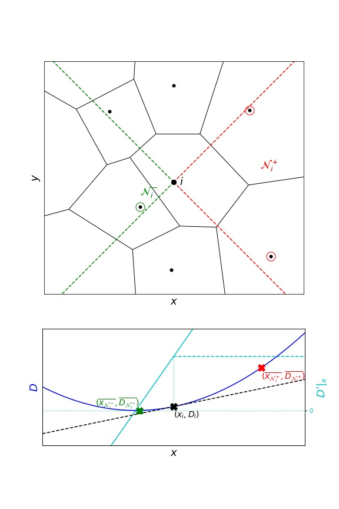
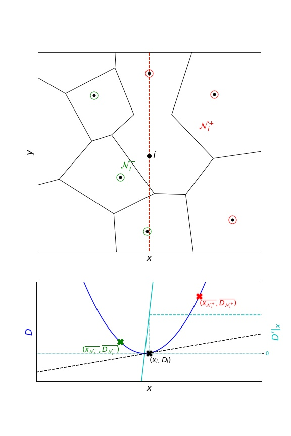
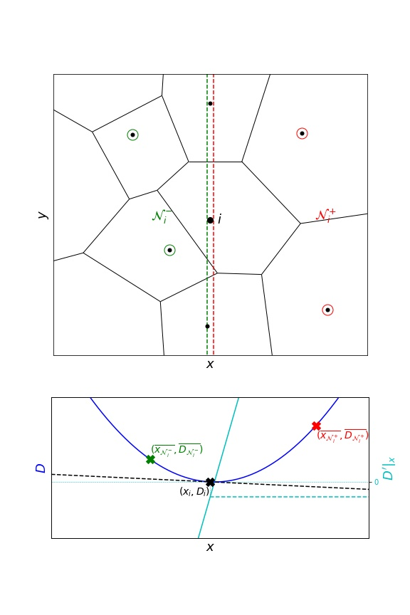
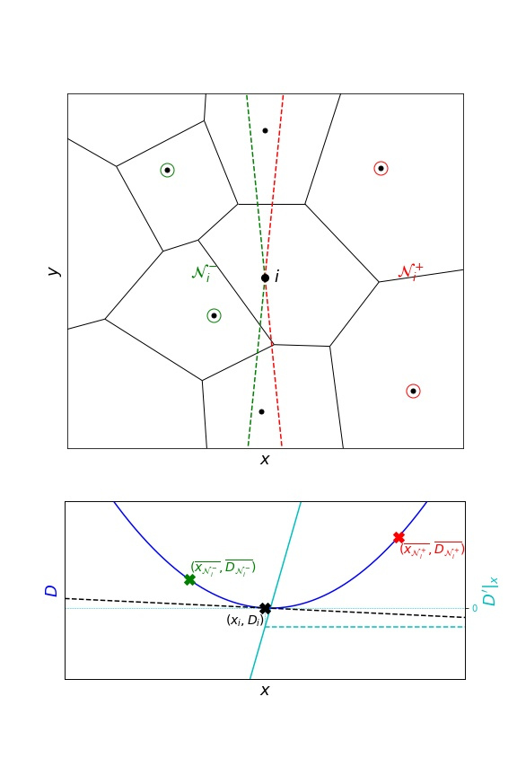

.. _gradient:

Gradients
=========

This section lists a few gradient calculation methods and also tells how to plug one's own gradient implementation into TRamWAy.

Independent components
----------------------

A first series of gradient calculations estimate each gradient component independently and first require that neighbours are selected and classified into two groups (left/right or bottom/top in 2D).

For the :math:`x` -component as an example, the :math:`x` -coordinate and the measurement which gradient is to be estimated (for example diffusivity :math:`D`) are averaged over the left neighbours on one side and over the right neighbours on the other side.
Together with the center bin, the gradient calculation can be expressed as a three-point regression problem that can be solved with an order-2 polynom, which is derived and evaluated at the center bin location.

In the case of no neighbours on the one side, the resulting two-point problem is solved similarly with a linear function.

See also the formulae in :func:`~tramway.inference.gradient.grad1` documentation.

InferenceMAP
^^^^^^^^^^^^

Neighbour selection in InferenceMAP consists of four equal quadrants (2D only).
A neighbour measurement is consequently considered only once, either for the :math:`x` - or the :math:`y` -component of the gradient.

This often results in fewer measurements and consequently less smoothing.

To switch to this method:

.. code-block:: python

	infer(..., grad_selection_angle=.5)

Others
^^^^^^

To include more neighbours, another approach considers half-spaces.

.. code-block:: python

	infer(..., grad_epsilon=0.)

The above example illustrates a class of situations where one or more neighbours are almost aligned along an orthogonal axis.
These neighbours may exhibit high leverage and generate inconsistent gradient estimates.

This scenario is especially common at the borders, where a single neighbour on the one side would actually be better considered as a neighbour on another axis only.
In other words, on a right border for example, a right neighbour will typically be a top or bottom neighbour.

To overcome this issue, an exclusion margin can be introduced:

To specify such a margin:

.. code-block:: python

	infer(..., grad_epsilon=1e-2)

Current default
^^^^^^^^^^^^^^^

Another approach similar to InferenceMAP quadrants consists of selecting the neighbours in an angular sector:

This is the current default in TRamWAy:

.. code-block:: python

	infer(..., grad_selection_angle=.9)

Argument `grad_selection_angle` is expressed in :math:`\pi` radians.

Multidimensional regression
---------------------------

TRamWAy also features an example multidimensional regression of the measurement which gradient is desired.

With:

.. code-block:: python

	infer(..., grad='gradn')

the measurement will be modeled as a multidimensional order-2 polynom that here again can be derived and evaluated at the center bin location.

However this approach proved to perform poorly in the context of *DV* inference, possibly resulting in the inference to diverge.

Overloading *grad*
------------------

One can plug her own gradient implementation (say ``my_grad``) in TRamWAy:

.. code-block:: python

	from tramway.helper import *

	class MyCells(Distributed):
	    def grad(self, cell_index, measurement_array, index_map=None):
	        return my_grad(cell_index, measurement_array, index_map)

	infer(..., new_group=MyCells)

See also the documentation for :meth:`~tramway.inference.base.Distributed.grad`.

